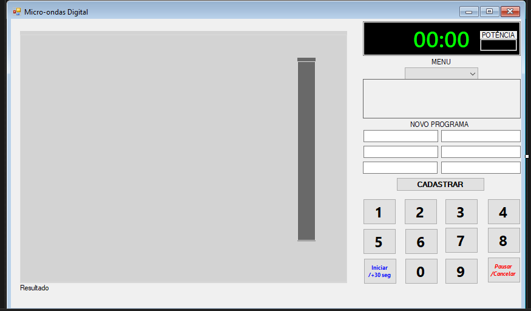

# Microondas Digital

## Descrição



Este projeto foi desenvolvido como parte de uma avaliação para **desenvolvedor de software**, com o objetivo de programar um **micro-ondas digital** utilizando **orientação a objetos**, separação de camadas e boas práticas de código. A avaliação foi estruturada em **quatro níveis de dificuldade**, e este projeto atendeu até o **nível 3** dos requisitos.

A proposta enfatiza a implementação correta das funcionalidades do micro-ondas, incluindo entrada de tempo e potência, programas pré-definidos, persistência de dados e manipulação de processos em tempo real, sem a necessidade de priorizar o design da interface gráfica. O projeto foi desenvolvido em **C# e .NET Framework**, seguindo princípios **SOLID** e utilizando **SQL Server Express** para armazenar programas de aquecimento customizados.

## Tecnologias Utilizadas

- **Linguagem:** C#
- **Framework:** .NET Framework 4.0 ou superior
- **Banco de Dados:** SQL Server Express (para persistência de programas customizados)
- **Padrões de Projeto:** SOLID
- **Arquitetura:** Camadas separadas entre interface de usuário e lógica de negócios

## Funcionalidades Implementadas

### **Nível 1**

- Interface para informação de tempo e potência via teclado digital ou entrada manual
- Inicialização do aquecimento com tempo e potência parametrizáveis
- Validação de entrada de tempo e potência
- Função de "Início Rápido" (30 segundos na potência 10)
- Acrescentar tempo durante aquecimento (+30 segundos ao pressionar iniciar)
- String visual de progresso do aquecimento
- Pausar e cancelar o aquecimento

### **Nível 2**

- Cadastro de 5 programas de aquecimento pré-definidos
- Restrição de alterações nos programas pré-definidos
- Strings de aquecimento personalizadas para cada programa
- Bloqueio de acréscimo de tempo nos programas pré-definidos

### **Nível 3**

- Cadastro de programas de aquecimento customizados
- Validação para evitar caracteres repetidos na string de aquecimento
- Diferenciação visual entre programas pré-definidos e customizados
- Persistência dos programas customizados em **SQL Server Express**

## Como Executar o Projeto

1. Clone este repositório:
   ```sh
   git@github.com:NoemiaGitHub/Microondas_Digital.git
   ```
2. Abra o projeto no **Visual Studio**
3. Certifique-se de que o **SQL Server Express** está instalado e configurado corretamente
4. Compile e execute a aplicação

## Documento de Avaliação

Os requisitos do projeto foram definidos em um documento de avaliação. Para acessar o documento completo, incluindo os **4 níveis**, acesse o arquivo abaixo:

📄 [Documento de Avaliação](docs/avaliacao_orientao_objeto_-_web_microondas.pdf)

## Possíveis Melhorias (Nível 4)

- Implementar **Web API** para expor as funcionalidades do micro-ondas
- Implementar autenticação via **Bearer Token**
- Criar **tratamento de exceptions** padronizado e log de erros

## Licença

Este projeto está licenciado sob a licença **MIT**. Para mais detalhes, consulte o arquivo [LICENSE](LICENSE).

---

**Desenvolvido por:** NoemiaGitHub


